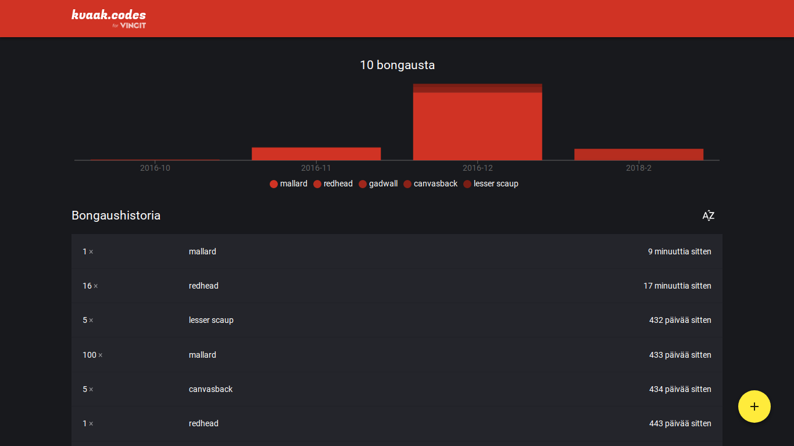

# Kvaak.codes

**Kvaak.codes** on Petja Tourun näkemys ja toteutus Vincitin kesähaasteesta, jossa haettiin Vincitin ankkabongaajille sovellusta havaintojensa kirjaamiseksi.

Ohjelma on toteutettu Reactilla, [Material-UI:lla](https://material-ui-next.com/), [Rechartsilla](http://recharts.org/#/en-US/) sekä lukuisilla riveillä omaa koodia. Motiivini projektissa on ollut tehdä mahdollisimman ammattimainen lopputulos.

## Demo

Ohjelmaa voi testata livenä osoitteessa **[kvaak.codes](https://kvaak.codes/)**. Frontti tekee pyyntöjä tehtävänannossa osoitettuun yksinkertaiseen palvelinsovellukseen. Asennusohjeita seuraamalla, ohjelman saa tekemään pyyntöjä myös muihin urleihin.

**[Testaa ohjelmaa heti &raquo;](https://kvaak.codes/)**

## Asennusohjeet
1. Kloonaa Github-repo ja vaihda kloonattuun kansioon
2. Tee tarvittavat muutokset `config.js` tiedostoon
3. Aja `yarn` depsien lataamiseksi ja asentamiseksi
4. Aja `yarn run build` käynnistääksesi webpackin, JSX- sekä ES6-tulkin. Mikäli tahdot minifoitua koodia, käytä komentona `yarn run build-prod`.
5. Aja `yarn run start` käynnistääksesi ohjelman
6. Valmis bongailemaan ankkoja :muscle:
